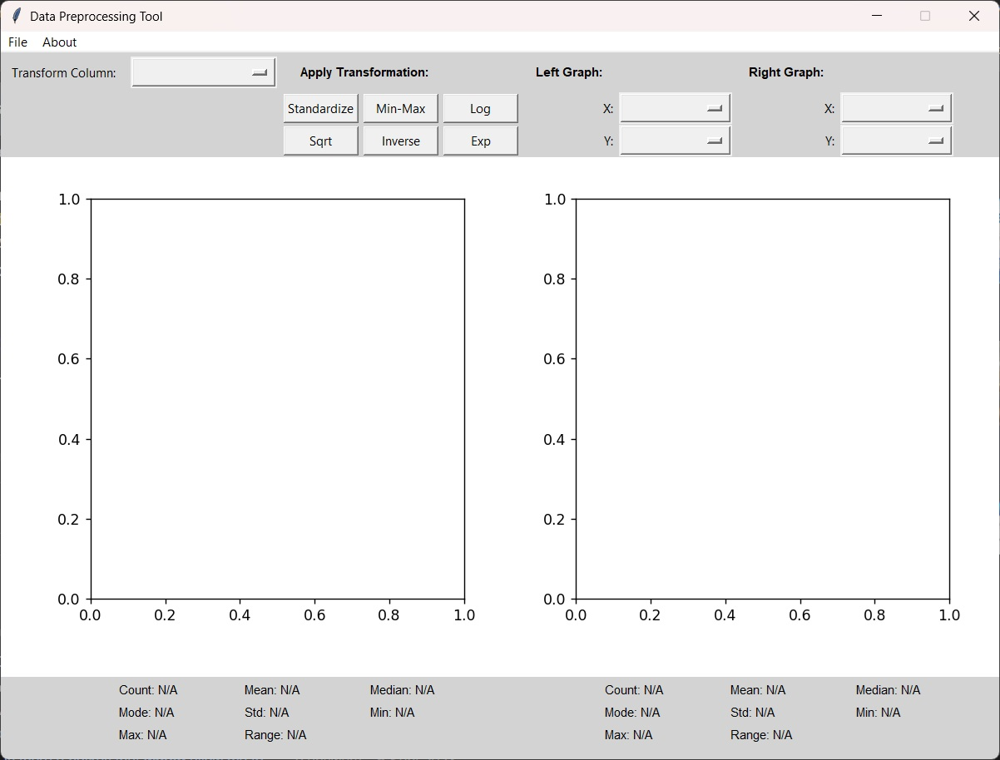
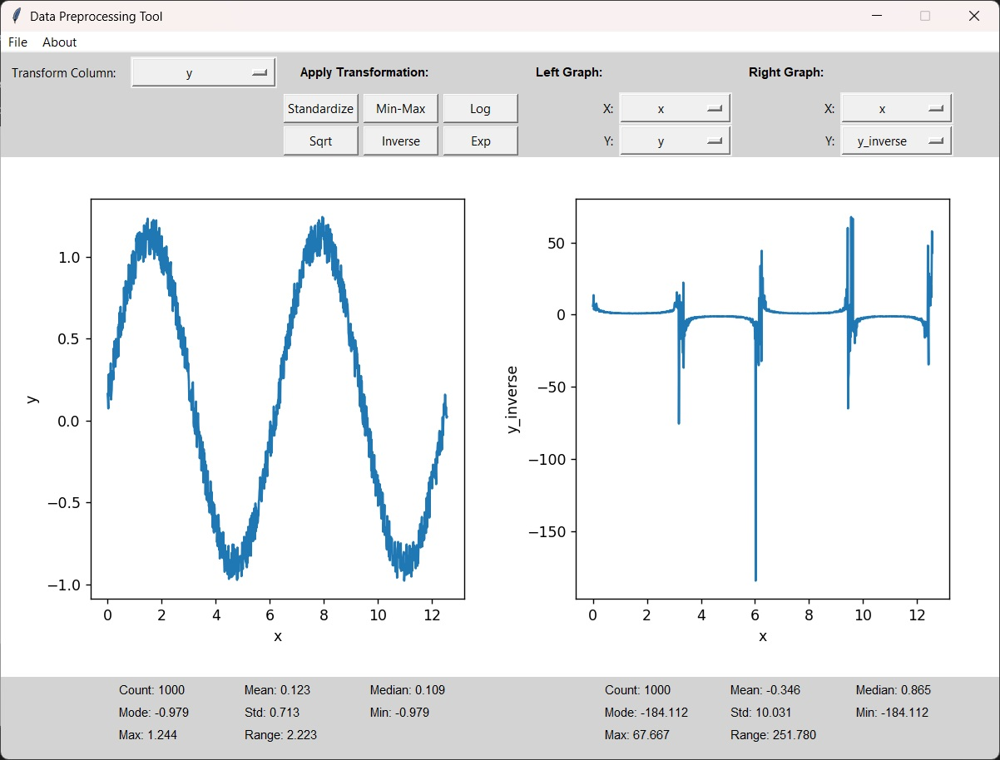

# Data Transform Tool

A simple Python-based GUI application for data preprocessing and visualization.  Import your datasets, apply mathematical transformations, and visualize the results side-by-side in real-time.

## Table of Contents 📑
1. [Overview](#overview)
2. [Features](#features)
3. [Installation](#installation)
4. [Usage](#usage)
5. [Transformations](#transformations)
6. [Statistics](#statistics)
7. [Project Structure](#project-structure)
8. [Requirements](#requirements)
9. [Screenshots](#screenshots)
10. [About the Author](#about-the-author)

---
<a name="overview"></a>
## Overview 📔

This tool is designed for quick data exploration and preprocessing. Load a CSV or Excel file, select columns to visualize on dual graphs, and apply transformations to see how they affect your data distribution.  Statistics are calculated and displayed automatically for both graphs.

Built with Tkinter for the GUI and matplotlib for visualization.  The interface is straightforward - no complicated menus or settings, just load your data and start transforming. 
<a name="features"></a>
## Features 🎳

- **Dual Graph Visualization** - Compare original and transformed data side-by-side
- **6 Mathematical Transformations** - Standardize, Min-Max, Log, Square Root, Inverse, Exponential
- **Real-Time Statistics** - Automatic calculation of 8 key statistics for each graph
- **Import/Export** - Support for both CSV and Excel formats
- **DPI-Aware Rendering** - Sharp text and graphics on high-resolution displays
- **Column Selection** - Choose any numeric columns for X and Y axes independently
<a name="installation"></a>
## Installation 💻

1. Clone the repository:
```bash
git clone https://github.com/dn-stef/data-transform-tool.git
cd data-transform-tool
```

2. Install dependencies:
```bash
pip install -r requirements.txt
```

3. Run the application:
```bash
python main.py
```

4. Try it with sample data:
   - Load any file from the `sample-data/` folder to test the features
<a name="usage"></a>
## Usage 🍴

1. **Import Data**
   - Click `File → Import Data`
   - Select a CSV or Excel file (or use files from `sample-data/`)
   - The tool automatically detects numeric columns

2. **Select Columns**
   - Use the dropdown menus under "Left Graph" and "Right Graph"
   - Choose X and Y columns for each graph independently
   - Graphs update automatically when selections change

3. **Apply Transformations**
   - Select a column from the "Transform Column" dropdown
   - Click any transformation button (Standardize, Min-Max, Log, etc.)
   - The transformation applies to the selected column
   - The transformed column is added as a new option in the graph dropdowns

4. **Export Data**
   - Click `File → Export Data`
   - Choose CSV or Excel format
   - Exported file includes the original data along with all applied transformations
<a name="transformations"></a>
## Transformations ⭐

The tool supports 6 mathematical transformations:

### **Standardize (Z-Score)**
Scales data to have mean = 0 and standard deviation = 1.  
Formula: `(x - mean) / std`

### **Min-Max Normalization**
Scales data to a 0-1 range.   
Formula: `(x - min) / (max - min)`  
*Note: Undefined when all values are identical (max = min)*

### **Log Transform**
Applies natural logarithm.  Useful for right-skewed distributions.  
Formula: `ln(x)`  
*Note: Only works on positive values*

### **Square Root**
Takes the square root of each value.  Reduces right skew.  
Formula: `√x`  
*Note: Only works on non-negative values*

### **Inverse**
Takes the reciprocal of each value.   
Formula: `1 / x`  
*Note: Undefined for zero values*

### **Exponential**
Applies exponential function.  
Formula: `e^x`
<a name="statistics"></a>
## Statistics 📈

Each graph displays 8 statistics in a 3x3 grid below the graphs:

- **Count** - Number of data points
- **Mean** - Average value
- **Median** - Middle value when sorted
- **Mode** - Most frequently occurring value
- **Std** - Standard deviation (spread of data)
- **Min** - Minimum value
- **Max** - Maximum value
- **Range** - Difference between max and min

Statistics update automatically when columns change or transformations are applied.

*Note: If the statistics panel below the graphs is not visible on your machine, try resizing the application window (drag the edges or maximize).*
<a name="project-structure"></a>
## Project Structure 🗼

```
data-transform-tool/
├── main.py                 # Entry point, launches the GUI
├── gui.py                  # Main GUI class and interface logic
├── utils.py                # Data import/export and statistics functions
├── transformations.py      # Mathematical transformation implementations
├── requirements.txt        # Python dependencies
├── sample-data/            # Example datasets for testing
└── screenshots/            # GUI screenshots for README
```

### **File Descriptions:**

- **main.py** - Initializes the application with DPI awareness and starts the GUI
- **gui.py** - Contains the `DataProcessingGUI` class with all UI components, controls, and event handlers
- **utils.py** - Handles file I/O operations and calculates statistics (mean, median, mode, etc.)
- **transformations. py** - Implements all 6 transformation functions with error handling
- **sample-data/** - Contains example CSV/Excel files for testing the tool
- **screenshots/** - Images of the GUI for documentation
<a name="requirements"></a>
## Requirements 🎨

- **Python 3.7+**
- **pandas** - Data manipulation and CSV/Excel handling
- **numpy** - Numerical operations and array processing
- **matplotlib** - Graph plotting and visualization
- **openpyxl** - Excel file support
- **tkinter** - GUI framework (included with Python)

Install all dependencies with:
```bash
pip install pandas numpy matplotlib openpyxl
```
<a name="screenshots"></a>
## Screenshots 📸

### Main Window


### Data Visualization with Transformation

<a name="about-the-author"></a>
## About the Author 🃏

I'm a physics graduate with a focus on data analysis and Python programming. This project was built to expand my skills in GUI development and data preprocessing while creating something practical and applicable to real-world workflows. 

I work with Python, data visualization, and building tools that simplify complex tasks.  This tool combines physics-oriented thinking with programming to make data exploration more accessible.  

---

## Acknowledgments 🤖

This GUI was built with assistance from **GitHub Copilot**, which helped accelerate development and implement features more efficiently. 

---

Built with Python, Tkinter, and matplotlib. 

<p align="center">
  
  
  
  
  
</p>
